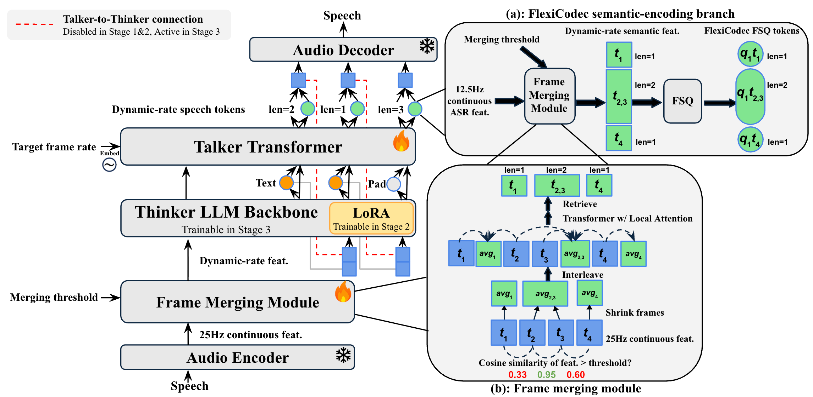

# FlexiSLM: A Spoken Language Model with Dynamic and Controllable Frame Rate

[](https://arxiv.org/abs/2606.31247)
[](https://flexislm.github.io)


## About
This repository contains the code for our paper "FlexiSLM: A Spoken Language Model with Dynamic and Controllable Frame Rate". Reproduced data and checkpoints, along with complete guide to train with the data, will be released soon this month.


About our paper: FlexiSLM is the first SLM that supports *dynamic* and *controllable* frame rates on both speech input and output. A single trained model can be steered between 12.5 Hz down to 4.0 Hz without retraining, and its dynamic frame rate mechanism adapts to the varying complexity of speech.
Key contributions include: 
- **Dynamic frame rate SLM framework and validation.** We introduce FlexiSLM, the first dynamic frame rate SLM framework, with dynamic frame compression on both speech input and output. Experiments show strong performance at 12.5 Hz and 6.25 Hz, with graceful degradation at 5.0 Hz and 4.0 Hz.
- **Accurate and practical frame rate control.** We propose direct frame rate conditioning, letting users specify the average output frame rate instead of indirectly tuning a merging threshold. This makes FlexiSLM, to our knowledge, the first SLM with frame rate controllability.
- **Strong quality-efficiency trade-off.** At 6.25 Hz output, FlexiSLM roughly *halves* AR inference time relative to 12.5 Hz with only minor quality degradation; at high-quality operating points, it outperforms fixed-rate 7B baselines such as Qwen2.5-Omni and Kimi-Audio.

<!--  -->

Overall FlexiSLM architecture is a Thinker-Talker model with dynamic frame-rate compression on speech input and controllable frame-rate generation on speech output.

<!-- The architecture of FlexiSLM is shown in the figure above.  -->

## News
- **August 2, 2026: Code release**. We have released the training and inference code of FlexiSLM-7B.
- Before September 1, 2026: Planned Reproduced FlexiSLM-Data and checkpoint release: We plan to release a reproduced version of FlexiSLM-7B and 5M samples of reproduced speech-to-speech dialog training data. We plan to release them before September 2026. 


## Training Guide


### Environment Setup

1. Clone the repository:
```bash
git clone <repo_url>
cd FlexiSLM
```

2. Install dependencies:
```bash
pip install -r requirements.txt
```

### Training Scripts
FlexiSLM training progresses in 3 stages:
1. **Talker pre-training.** Freeze the LLM backbone and train only the randomly initialized Talker end to end on about 100K hours of English TTS. We also add ASR data to pretrain the input merging transformer.
2. **Multi-task LoRA fine-tuning.** Activate the input-side Frame Merging Module, Thinker, and Talker; apply LoRA to the Thinker and train on mixed speech tasks.
3. **Full fine-tuning.** Continue from Stage 2, merge the LoRA updates into the LLM, train all parameters, and enable the Talker-to-Thinker connection to improve speech perception and generation quality.


Training arguments are stored in YAML files under `config/`, while the launch scripts live under `scripts/`:

| Stage | Configuration | Launcher |
| --- | --- | --- |
| Stage 1 | `config/train_stage1.yaml` | `scripts/train_stage1.sh` |
| Stage 2 (v2 merging) | `config/train_stage2.yaml` | `scripts/train_stage2.sh` |
| Stage 2 (v1 merging) | `config/train_stage2_v1merging.yaml` | `scripts/train_stage2_v1merging.sh` |
| Stage 3 (v2 merging) | `config/train_stage3.yaml` | `scripts/train_stage3.sh` |
| Stage 3 (v1 merging) | `config/train_stage3_v1merging.yaml` | `scripts/train_stage3_v1merging.sh` |

Set the Qwen2.5-Omni encoder paths before launching:

```bash
export QWEN25O_ENCODER_PATH=/path/to/qwen25o_encoder
export QWEN25O_ENCODER_CONFIG_PATH=/path/to/audio_config.json
bash scripts/train_stage1.sh
```

The YAML values can be overridden from the command line:

```bash
bash scripts/train_stage2.sh \
  --learning_rate 2e-6 \
  --output_dir outputs/custom_stage2
```

Use the shared launcher to run a custom configuration:

```bash
bash scripts/train.sh config/train_stage2.yaml
```

The scripts detect local or distributed GPU settings through `scripts/env.sh`. They are launch templates, so adjust environment-specific paths and cluster settings before use.

### Dataset Preparation Workflow

Prepare your dataset in three steps.

Step 1: format your JSONL like the provided examples:
- `examples/data/asr.jsonl`
- `examples/data/tts.jsonl`
- `examples/data/dialog.jsonl`

The common JSONL format is:

```json
{
  "messages": [
    {"role": "system", "content": "Respond in a text-audio interleaved manner."},
    {"role": "user", "content": "<|audio|>"},
    {"role": "assistant", "content": "Hello! <|audio|>"}
  ],
  "audios": [
    "/abspath/to/user.wav",
    "/abspath/to/assistant.wav"
  ]
}
```
(system message are always overwritten by Qwen-Omni's system message in our setting. Configure this behavior in src/dataset/interleaved.py)


Important constraints:
- `messages[*].content` containing `<|audio|>` means one audio item should be consumed.
- The total count of `<|audio|>` placeholders must match `len(audios)` for each sample.
- `audios` may use absolute paths, or relative paths resolved from `audio_root` in YAML.

Step 2: use the precompute script to append audio duration/token metadata.

Script path:
- `src/dataset/precompute_audio_durations.py`

Single JSONL:

```bash
python src/dataset/precompute_audio_durations.py \
  --input path/to/train.jsonl \
  --audio-root path/to/audio_root \
  --workers 32
```

Batch mode (process all `data_paths` listed in a YAML file):

```bash
python src/dataset/precompute_audio_durations.py \
  --yaml path/to/train_recipe.yaml \
  --workers 32
```

Output naming:
- `train.jsonl` -> `train.with_durations.jsonl`

Added fields:
- `audio_durations`
- `audio_tokens`
- `num_tokens_est`

Step 3: update YAML recipes to include your dataset files.
Then pass the YAML paths to training via `--dataset_name` and `--dataset_name_eval`.

Example YAML:

```yaml
xlsx_sample_num: 5
audio_root: path/to/audio_root

dataset:
  my_train_set:
    ratio: 1.0
    data_paths:
      - path/to/train.with_durations.jsonl

  my_eval_set:
    ratio: 1.0
    data_paths:
      - path/to/eval.with_durations.jsonl
```

Supported `data_paths` types:
- JSONL file
- local directory / file containing WebDataset `.tar` shards (`data_format: webdataset`)
- parquet/local HF dataset path or HF dataset id

## Inference Guide

Primary inference script: `src/inference_flexislm.py`.

Use:

```bash
python -m src.inference_flexislm --help
```

Minimal API examples:

```python
from src.inference_flexislm import InterleavedInferenceConfig, InterleavedS2SInference

cfg = InterleavedInferenceConfig(
    model_path="/path/to/flexislm_checkpoint",
    use_flow_matching_decoder=False,
    flexicodec_ckpt_path="/path/to/flexicodec_ckpt.safetensors",
    flexicodec_config_path="/path/to/flexicodec_config.yaml",
    sensevoice_path="/path/to/SenseVoiceSmall",
)
engine = InterleavedS2SInference(cfg, device="cuda")

debug_sentence = "And henry the eighth appropriated to himself the religious house of grey ladies and all the properties appertaining thereto."
debug_audio_path = "/path/to/input_audio.wav"

# Text-to-Speech Synthesis
tts = engine.generate_tts(
    sentence=debug_sentence,
    framerate=1.0,
)

# Text-to-Speech
t2s = engine.generate_from_text(
    text_input=f"Please read the following text: {debug_sentence}",
    history="",
    framerate=1.0,
    output_text_only=False,
)

# Speech-to-Speech
s2s = engine.generate_from_audio(
    audio_path=debug_audio_path,
    text_query="Please respond naturally to the audio in speech.",
    history="",
    framerate=1.0,
    output_text_only=False,
)

# Speech-to-Text
s2t = engine.generate_from_audio(
    audio_path=debug_audio_path,
    text_query="Please transcribe the speech in the audio.",
    history="",
    framerate=1.0,
    output_text_only=True,
)

# Text-to-Text
t2t = engine.generate_from_text(
    text_input="What is dynamic frame rate in speech modeling? Answer in one sentence.",
    history="",
    framerate=1.0,
    output_text_only=True,
)
```

Quick debug run (same five modes in script):

```bash
python -m src.inference_flexislm \
  --model_path /path/to/flexislm_checkpoint \
  --debug \
  --debug_audio_path /path/to/input_audio.wav
```

Minimal notebook example (imports inference module and runs T2T/S2T/TTS):

```bash
examples/inference.ipynb
```

## Citation

```bibtex
@misc{li2026flexislmdynamiccontrollableframe,
      title={FlexiSLM: A Dynamic and Controllable Frame Rate Spoken Language Model},
      author={Jiaqi Li and Chaoren Wang and Xiaohai Tian and Mingjie Chen and Xinyu Liang and Xu Li and Yufan Lin and Junwen Qiu and Jun Zhang and Lu Lu and Haizhou Li and Zhizheng Wu},
      year={2026},
      eprint={2606.31247},
      archivePrefix={arXiv},
      primaryClass={cs.SD},
      url={https://arxiv.org/abs/2606.31247},
}
```

## License

This project is licensed under the MIT License. See [LICENSE](LICENSE) for details.
